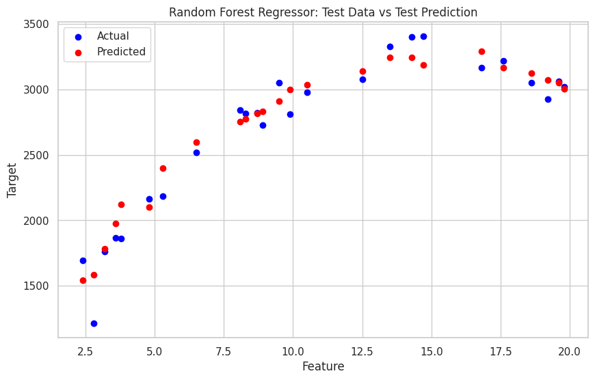

# Supervised - Salary Prediction - Regression
This project aims to build a salary prediction model using supervised learning. The dataset is analyzed and processed using Python in Google Colab. The regression models employed include Linear Regression, Decision Tree Regression, and Random Forest Regression.

## Key Features
- Data Ingestion: Load and inspect the dataset using pandas.
- EDA: Visualize the relationship between experience and salary.
- Data Preparation: Handle duplicates, check missing values, and preprocess data.
- Modeling: Train and evaluate:
  - Linear Regression
  - Decision Tree Regression
  - Random Forest Regression
- Evaluation: Compare models using metrics like MSE and R².
- Model Persistence: Save trained models for future use.
